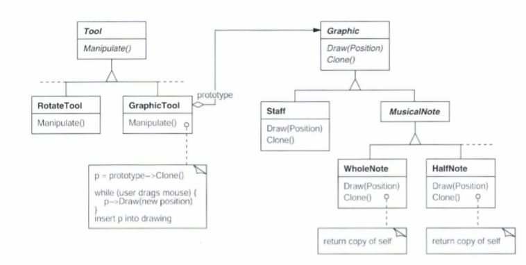
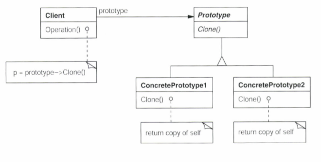
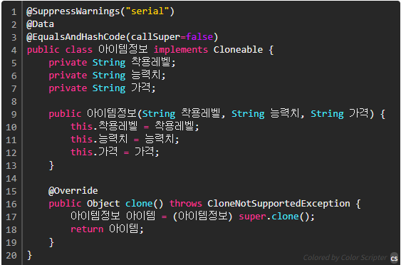
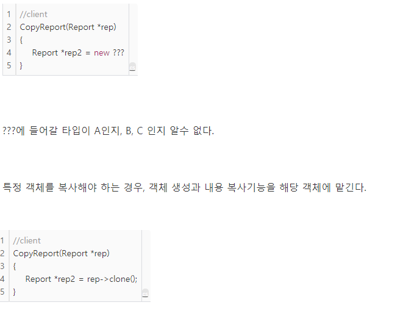

# prototype(원형) pattern

### 정의
Client가 의존성을 가지는 class의 subclass 인스턴스를 복제(cloning)함으로써 새로운 Client 인스턴스를 만든다.
이때 복제된 subclass 인스턴스를 원형(prototype)이라 부른다. (ConcretePrototype 각각이 모두 원형)

### 동기
 
GraphicTool이 Graphic 클래스를 생성하고 참조함. 
Graphic 클래스는 악보, 서양화, UML 등 다양한 서브클래스를 가지고 있음. 
GraphicTool은 범용적 프레임워크에 속해있기 때문에, Graphic클래스의 어떤 서브클래스를 생성해야 하는지 모름  
Graphic 클래스의 서브클래스가 너무 다양하므로, GraphicTool을 모두 서브클래싱 하는것을 피하고 싶음. 
=> GraphicTool에서 Graphic의 서브클래스 인스턴스를 Graphic클래스의 clone() 메소드를 이용해 가져옴으로써 GraphicTool 인스턴스를 다양하게 초기화 함. 

### 구조

### 구현
- 원형 관리자 : 원형의 등록, 조회, 삭제 기능을 제공. 런타임에 작동되는 핵심 코어
- Initialize()와 getter(), setter() : 원형으로부터 clone한 인스턴스의 초기화

### 활용성과 장점
1. 복잡하거나 동일한 인스턴스를 계속해서 생성하는 불편함을 감수하지 않아도 된다. - 가장 단순하게 prototype을 이해하고 사용하는 경우 
 
 + 일정 패턴의 원형들을 미리 초기화해 두고, 원형 관리자에서 호출함으로써 쉽게 사용할 수 있다. 
2. client 클래스가 참조하는 객체의 유연성 보장 
 
3. 런타임 시 다양한 필드값의 새로운 인스턴스를 쉽게 만들 수 있다. 
4. Client클래스와 서브클래스 수를 대폭 감소시킬 수 있다.

### 유의할 점

1. clone 메소드
    - 원형 별로 얕은 복사와 깊은 복사를 달리 사용한다.
    - "본질적으로 clone 메소드는 또 다른 종류의 생성자나 마찬가지다. 원본 객체에 피해를 주면 안되고, 복제본 객체는 클래스의 불변 규칙을 지켜야 한다." - Joshua Bloch [Effective Java]
    
2. clone() 연산에 매개변수 정의 NO! 복제 인터페이스의 일관성이 떨어진다.

---
참고 :  

clone 메소드 : https://gyrfalcon.tistory.com/entry/Java-Tip-clone%EA%B3%BC-Cloneable    
simple.png :  https://itjava.tistory.com/95      
extend.png : https://palpit.tistory.com/189   
예제코드 : https://hadeslee.tistory.com/84    

참고하면 좋을 페이지 :  
http://astrod.github.io/design_pattern/2017/04/26/%ED%94%84%EB%A1%9C%ED%86%A0%ED%83%80%EC%9E%85-%EB%94%94%EC%9E%90%EC%9D%B8-%ED%8C%A8%ED%84%B4/