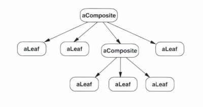
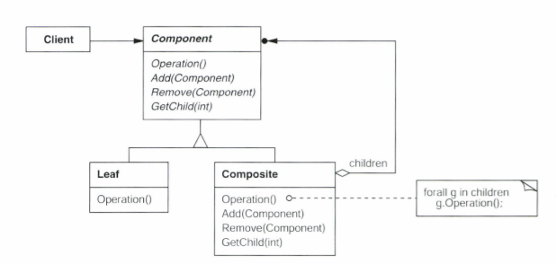
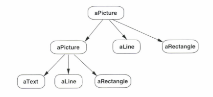
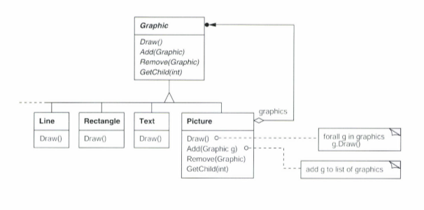

# composite (복합체)

## 의도
- 객체의 집합을 트리 구조로 구성
- Client가 개별객체와 복합객체를 동일하게 다룸

## 동기
- 요소 -> 집합 -> 더 큰 집합 -> ... 의 트리 구조를 표현할 때, 사용자가 요소나 컨테이너에 접근하려면 
- 이 때 Client로 하여금 집합(컨테이너)와 요소의 구분없이, 동일한 인터페이스로 요소 또는 집합 내의 요소에 접근하게 하고 싶음

## 개념과 구현
### 참여자
- Component : 집합 관계에 정의될 모든 객체에 대한 인터페이스.
- Leaf : 가장 말단, 기본 요소 객체
- Composite : Leaf와 Composite를 자식으로 갖는 클래스.
- Client : Component 인터페이스를 통해 복합 구조 내의 객체를 조작.

### 트리 구조

### 구현

1. 복합객체(Composite)와 단일객체(Leaf)를 표현하는 하나의 추상클래스(Component)를 정의
2. 단일 객체(Leaf)의 Operation() 메소드는 자기 자신의 연산 수행
3. 복합 객체(Coposite)의 Operation()은 자신이 참조하는 단일 객체들의 Operation()을 각각 수행
4. 복합 객체는 단일객체를 저장, 삭제하는 메소드를 구현

## 예시
### 트리

### 구조

## 결과
1. 기본 객체와 복합 객체로 구성된 하나의 일관된 클래스 계통을 정의함으로써, 각각의 구분 없이 일관된 프로그래밍 가능
2. 복합객체와 단일객체의 구분이 필요 없으므로 코드가 단순해짐
3. 새로운 구성요소(Leaf)의 추가가 쉬움
4. 단점 - 새로운 구성요소(Leaf)가 추가될 때, 복합체의 구성요소에 제약을 가하기 힘들다

## 세부 구현
1. 자식 객체에서 부모 객체에 대한 참조자를 선언하는 것이 좋다.  
    - Component 클래스에 부모 객체에 대한 참조변수를 선언
    - 구조를 거슬러 올라가거나, 요소를 삭제하는 데 유리
    - 책임 연쇄 패턴의 구현  
2. 구성요소 공유  
    - 메모리 저장공간의 절약
    - 플라이급 패턴을 활용하면 좋다.

3. Component 인터페이스를 최대화
    - 모든 연산을 정의

4. 그렇다면, Add()메서드와 Remove()메서드까지 Component에서 정의하는가
    - 책에서는 Component에 부여하는 것을 권장
    - Client에게 인터페이스의 투명성 부여해주지만, 동일하게 Component를 상속받는 Leaf클래스에서 안정성 유지를 위한 처리를 해주어야 한다.

5. Component에서 자식 객체의 리스트를 관리하지 않는다.

6. Composite 클래스에서 자식 객체의 순서가 중요할 때는 반복자 패턴을 활용하자

7. 복합구조 내부를 수시로 순회해야 한다면 Composite클래스에 자식객체를 순회하는 정보를 미리 저장한다 - 캐싱(Caching) 전략

8. 가비지 컬렉션의 기능이 제공되지 않는다면, Composite 클래스에서 삭제를 담당한다.

9. 구성요소를 관리하기 위해서 어떤 데이터 구조를 사용할지 고민해야 한다.

## 관련 패턴

1) 책임 연쇄 패턴
    - 구성 요소와 부모간의 연결을 구현
2) 장식자 패턴
3) 플라이급 패턴
    - 구성 요소 공유
4) 반복자 패턴
    - 구성 요소 순회
5) 방문자 패턴