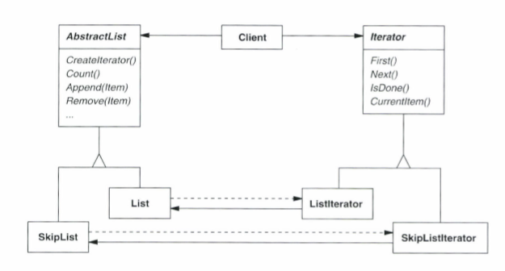

# iterator
### 다른이름 : 커서(cursor)


## 기본개념 
리스트(list)등의 집합 객체에 접근하는 인터페이스를 제공하는 클래스

## 구조

      
  
  - CreateIterator()는 '팩토리 메서드 패턴'을 사용.

## 구현
- 반복을 제어하는 주체에 따라 '외부 반복자'와 '내부 반복자'로 나뉜다.
- 순회 알고리즘을 AbstractList클래스와 Iterator클래스 둘 중 어디에서 구현할 지 정해야 한다.
- iterator를 견고하게(thread safe하게)만들기 위해, 집합 객체를 복사해서 순회하거나 집합객체가 iterator를 참조하게 하여 상태 변경 시 iterator의 상태도 변경되도록 한다.

## 장점
- 집합 객체의 다양한 순회 방법을 제공  
- 집합객체의 인터페이스를 단순화

## 예시코드
- ArrayList에서의 Iterator() 메소드
```java
public class ArrayList<E> extends AbstractList<E>
        implements List<E>, RandomAccess, Cloneable, java.io.Serializable
{
    public Iterator<E> iterator() {
        return new Itr();
    }

    /**
     * An optimized version of AbstractList.Itr
     */
    private class Itr implements Iterator<E> {
        int cursor;       // index of next element to return
        int lastRet = -1; // index of last element returned; -1 if no such
        int expectedModCount = modCount;

        Itr() {}

        public boolean hasNext() {
            return cursor != size;
        }

        @SuppressWarnings("unchecked")
        public E next() {
            checkForComodification();
            int i = cursor;
            if (i >= size)
                throw new NoSuchElementException();
            Object[] elementData = ArrayList.this.elementData;
            if (i >= elementData.length)
                throw new ConcurrentModificationException();
            cursor = i + 1;
            return (E) elementData[lastRet = i];
        }

        public void remove() {
            if (lastRet < 0)
                throw new IllegalStateException();
            checkForComodification();

            try {
                ArrayList.this.remove(lastRet);
                cursor = lastRet;
                lastRet = -1;
                expectedModCount = modCount;
            } catch (IndexOutOfBoundsException ex) {
                throw new ConcurrentModificationException();
            }
        }

        @Override
        @SuppressWarnings("unchecked")
        public void forEachRemaining(Consumer<? super E> consumer) {
            Objects.requireNonNull(consumer);
            final int size = ArrayList.this.size;
            int i = cursor;
            if (i >= size) {
                return;
            }
            final Object[] elementData = ArrayList.this.elementData;
            if (i >= elementData.length) {
                throw new ConcurrentModificationException();
            }
            while (i != size && modCount == expectedModCount) {
                consumer.accept((E) elementData[i++]);
            }
            // update once at end of iteration to reduce heap write traffic
            cursor = i;
            lastRet = i - 1;
            checkForComodification();
        }

        final void checkForComodification() {
            if (modCount != expectedModCount)
                throw new ConcurrentModificationException();
        }
    }
}

public interface Iterator<E> {
    boolean hasNext();
    E next();
    default void remove() {
        throw new UnsupportedOperationException("remove");
    }
    default void forEachRemaining(Consumer<? super E> action) {
        Objects.requireNonNull(action);
        while (hasNext())
            action.accept(next());
    }
}

```

- 내부반복자
```java
public class InternalIterationList<E> extends ArrayList<E> {
    
    private static final long serialVersionUID = 1L;

    // 반복 작업을 처리하게 할 콜백 인터페이스.
    // 편의상 스테틱 내부 인터페이스로 구현
    public static interface Callback<E> {
        public E map(E e);
    }
    
    // 실제 반복자. 자신의 요소에 콜백을 한번씩 호출
    public void each(Callback<E> callback) {
        int len = this.size();
        for (int i = 0; i < len; i++) {
            callback.map(this.get(i));
        }
    }
    
    @Test
    public void testClass() {
        InternalIterationList<String> internalIterator 
            = new InternalIterationList<String>();
        
        internalIterator.add("Hello");
        internalIterator.add(", ");
        internalIterator.add("World");
        
        // 내부 반복
        internalIterator.each(new Callback<String>() {
            
            @Override
            public String map(String e) {
                System.out.print(e);
                return e;
            }
        });
    }
}
```

---
예시코드 참고 - 
https://blog.javarouka.me/2012/01/01/internal-external-iterator/