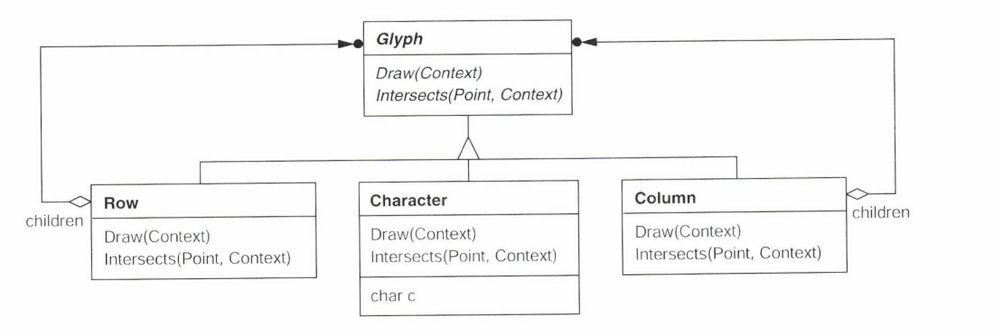
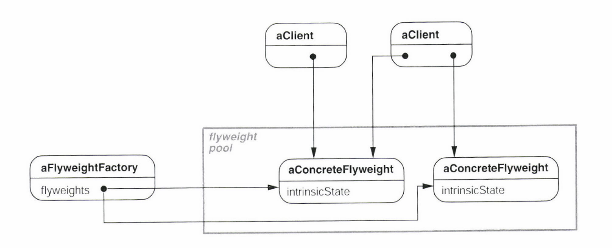

# Flyweight

###  의도

- 공유를 통해 많은 수의 fine-grained 객체들을 효과적으로 지원  

### 동기

- 객체 중심의 설계는 많은 이점이 있지만 하단을 실제로 구현하는 비용이 큼 

### 예시 - 문서편집기

- 단일 문자 하나하나를 객체로 만들게 되면 수천자의 글자는 수천개의 객체를 필요로 하게됨
- 본질적인 것(intrinsic- 문자)와 부가적인 것(extrinsic - 위치, 글꼴, 색깔 등)을 나누고 본질적인 것은 공유
    
- Glyph 는 그래픽 객체에 대한 추상글래스(인터페이스)
- 부가적 상태에 따라 달라지는 연산에 상태(Context)를 매개변수로 전달
    
### 활용성
- 응용프로그램이 대량의 객체를 사용해야할 때
- 객체의 수가 너무 많아 저장 비용이 클 때 
- 대부분의 객체 상태를 부가적인 것으로 만들 수 있을 때
- 부가적인 것을 제외했을 때 공유된 객체로 대체 가능할 때
- 응용프로그램이 객체의 정체성에 의존하지 않을 때(식별성이 없어도 될 때)

    

###  참여자
    
- Flyweight (Glyph): Flyweight 가 받아 들일 수 있고 부가적 상태에서 동작해야하는 인터페이스 정의
- ConcreteFlyweight (Row,Column): 
    - Flyweight 인터페이스를 구현하고 내부적으로 갖고 있어야하는 본질적 상태에 대한 저장소. 
    - ConcreteFlyweight 객체는 공유 할 수 있어야하고 본질적이어야 한다
- UnsharedConcreteFlyweight: 
    - 모든 플라이급 서브클래스들이 공유될 필요는 없음
    - Flyweight 인터페이스는 공유를 가능하게 하지만 강요해서는 안됨
    - UnsharedConcreteFlyweight 가 ConcreteFlyweight 를 자식으로 가질 수도 있음.
- FlyweightFactory: 플라이급 객체를 생성하고 관리, 공유되도록 보장.
- Client: 플라이급 객체에 대한 참조자를 관리, 플라이급 객체의 부가적 상태를 저장. 
 

### 참여 방법
        
    
### 협력 방법
- 플라이급 객체가 기능ㅇ르 수행하는데 필요한 상태가 본질적인 것인지 부가적인 것인지 구분
- 본질적 상태는 ConcreteFlyweight 에 , 부가적인 것은 client 또는 연산되어야 하는 다른 상태로 저장
- **사용자는 연산을 호출 할 때 필요한 부가적 상태를 플라이급 객체에 매개변수로 전달**
  
### 결과
- 기존에 모두 본질적이었던것을 본질적인 것과 부가적인 것으로 분리 
    - pros
        - 생성되는 객체의 수 감소
        - 사용되는 메모리 감소
    - cons: 
        - 모든 오브젝트들이 하나의 본질을 공유하므로 예외적인 수행을 할 수 없다
        - [한번에 많은 수의 오브젝트가 필요한 경우 초기로드 중에 지연이 발생 될 수 있다(?)](https://examples.javacodegeeks.com/core-java/java-flyweight-design-pattern-example/)
        - 부가적인 상태의 연산과 전송 비용 증가(?)

### 구현
- 부가적 상태를 제외
    - 패턴의 활용 여부는 얼마나 쉽게 공유할 객체에서 부가적인 상태를 식별, 분리 하는가에 달림
    
- 공유할 객체를 관리
    - 객체는 공유되어야 하므로 사용자가 직접 인스턴스를 생성하게하면 안됨
    - FlyweightFactory 가 이 역할을 수행
    - 공유 가능성은 플라이급 객체가 필요하지 않을 때 그것을 해제하는 참조 카운팅 또는 가비지 컬렉션 능력에 좌우.
        - Flyweight 수가 고정되어 있고, 작다면 둘다 필요 없음 (굳이 메모리에서 삭제할 필요 없음)
       
### 예제 코드

[Tree-And-Forest](https://refactoring.guru/design-patterns/flyweight/java/example)
